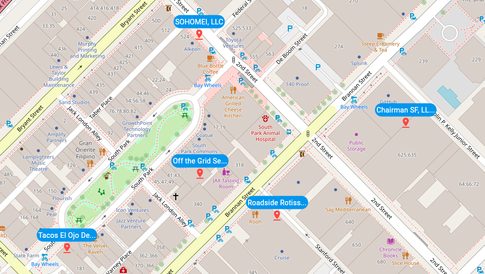
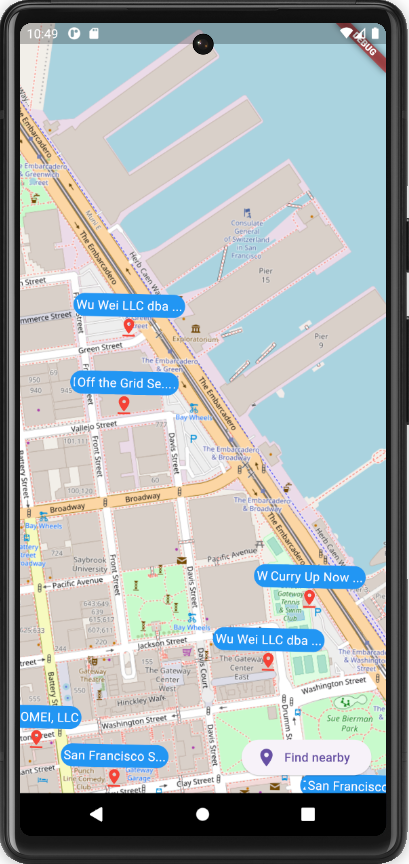
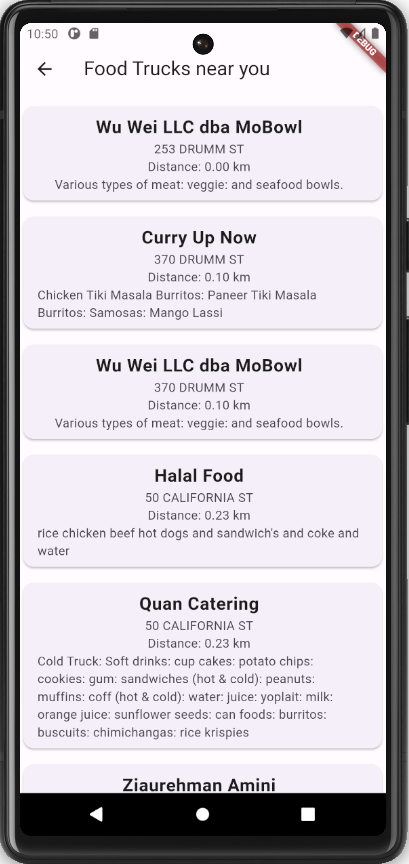
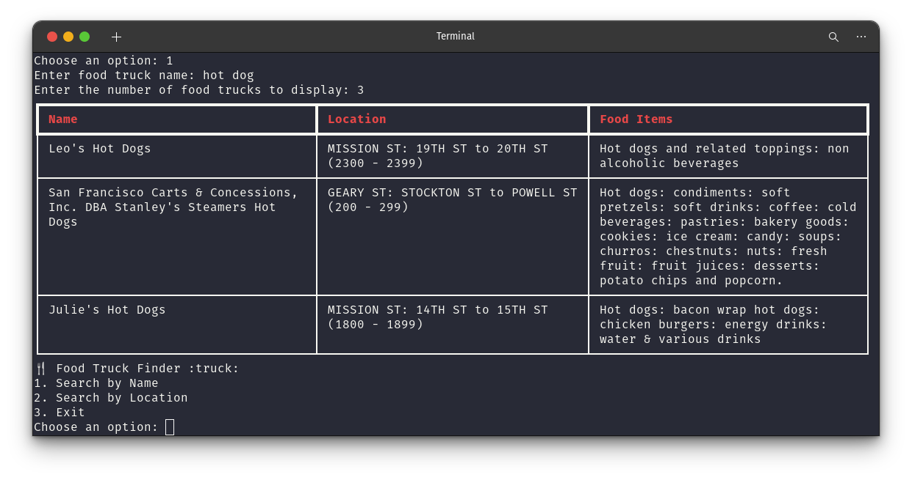

# Food Truck API

## Overview

The Food Truck API provides access to food truck data, including searching by name, retrieving all food trucks, and finding the nearest trucks based on geographic location.

## Frontend
The frontend is a simple web application and mobile app that allows users to search for food trucks by name or find the nearest trucks based on their current location.

You can access the web application [here](https://coral-app-5wwc7.ondigitalocean.app/).





## API

### 1. Get All Food Trucks

- **Description**: Retrieve a list of all food trucks.
- **Method**: `GET`
- **URL**: `/food-trucks/`
- **Query Parameters**: None
- **Example Request**: 
  ```
  GET /food-trucks/
  ```

### 2. Search Food Trucks by Name

- **Description**: Search for food trucks by name.
- **Method**: `GET`
- **URL**: `/food-trucks/`
- **Query Parameters**: 
  - `name`: The name (or part of the name) of the food truck.
- **Example Request**: 
  ```
  GET /food-trucks/?name=Leo's Hot Dogs
  ```

### 3. Get Nearest Food Trucks

- **Description**: Find the nearest food trucks based on latitude and longitude.
- **Method**: `GET`
- **URL**: `/food-trucks/`
- **Query Parameters**: 
  - `latitude`: Latitude of the current location.
  - `longitude`: Longitude of the current location.
  - `top_n`: Number of nearest trucks to return.
- **Example Request**: 
  ```
  GET /food-trucks/?latitude=37.76&longitude=-122.42&top_n=5
  ```

## Responses

Responses are returned in JSON format. Below are the typical response fields for a food truck:

- `id`: Unique identifier of the food truck.
- `applicant`: Name of the food truck applicant.
- `facility_type`: Type of the food truck facility.
- `location_description`: Description of the truck's location.
- `address`: Address of the food truck.
- `food_items`: List of food items available at the truck.
- `latitude`: Latitude coordinate of the food truck.
- `longitude`: Longitude coordinate of the food truck.

## Example Response

```json
[
    {
        "id": "e9a4e41f-4071-43d3-8b7a-aa1ddb3eefef",
        "applicant": "Leo's Hot Dogs",
        "facility_type": "Push Cart",
        "location_description": "MISSION ST: 19TH ST",
        "address": "2301 MISSION ST",
        "food_items": "Hot dogs and related toppings",
        "latitude": 37.7601,
        "longitude": -122.4188
    },
    // More trucks...
]
```


# CLI Application
The script can be run in two ways:

Command-Line Arguments:

```bash
python cli.py search --name="Leo's Hot Dogs"
python cli.py search --latitude=37.76 --longitude=-122.42
```

Interactive Mode:

```bash
python cli.py interactive
```

Or simply:

```bash
python cli.py
```

