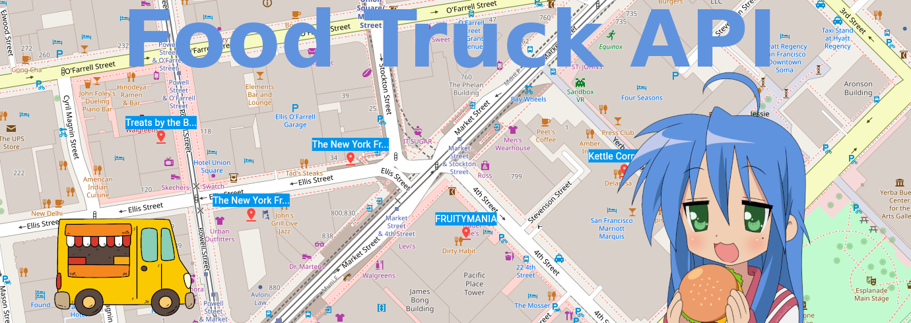

## Overview

The Food Truck API provides access to food truck data, including searching by name, retrieving all food trucks, and finding the nearest trucks based on geographic location.

## Frontend
The frontend is a simple web application and mobile app that allows users to search for food trucks by name or find the nearest trucks based on their current location.

You can access the web application [here](https://coral-app-5wwc7.ondigitalocean.app/).


## API

### 1. Get All Food Trucks

- **Description**: Retrieve a list of all food trucks.
- **Method**: `GET`
- **URL**: `/food-trucks/`
- **Query Parameters**: None
- **Example Request**: 
  ```
  GET /food-trucks/
  ```

### 2. Search Food Trucks by Name

- **Description**: Search for food trucks by name.
- **Method**: `GET`
- **URL**: `/food-trucks/`
- **Query Parameters**: 
  - `name`: The name (or part of the name) of the food truck.
- **Example Request**: 
  ```
  GET /food-trucks/?name=Leo's Hot Dogs
  ```

### 3. Get Nearest Food Trucks

- **Description**: Find the nearest food trucks based on latitude and longitude.
- **Method**: `GET`
- **URL**: `/food-trucks/`
- **Query Parameters**: 
  - `latitude`: Latitude of the current location.
  - `longitude`: Longitude of the current location.
  - `top_n`: Number of nearest trucks to return.
- **Example Request**: 
  ```
  GET /food-trucks/?latitude=37.76&longitude=-122.42&top_n=5
  ```

## Responses

Responses are returned in JSON format. Below are the typical response fields for a food truck:

- `id`: Unique identifier of the food truck.
- `applicant`: Name of the food truck applicant.
- `facility_type`: Type of the food truck facility.
- `location_description`: Description of the truck's location.
- `address`: Address of the food truck.
- `food_items`: List of food items available at the truck.
- `latitude`: Latitude coordinate of the food truck.
- `longitude`: Longitude coordinate of the food truck.

## Example Response

```json
[
    {
        "id": "e9a4e41f-4071-43d3-8b7a-aa1ddb3eefef",
        "applicant": "Leo's Hot Dogs",
        "facility_type": "Push Cart",
        "location_description": "MISSION ST: 19TH ST",
        "address": "2301 MISSION ST",
        "food_items": "Hot dogs and related toppings",
        "latitude": 37.7601,
        "longitude": -122.4188
    },
    // More trucks...
]
```


# CLI Application
The script can be run in two ways:

Command-Line Arguments:

```bash
python cli.py search --name="Leo's Hot Dogs"
python cli.py search --latitude=37.76 --longitude=-122.42
```

Interactive Mode:

```bash
python cli.py interactive
```

Or simply:

```bash
python cli.py
```


# How to Run Locally

## 1. Clone the Repository
```bash
git clone https://github.com/teixeirazeus/Food-Truck
```

## 2. Enter the Directory
```bash
cd Food-Truck
```

## 3. Create a Virtual Environment
```bash
python3 -m venv env
source env/bin/activate
```

## 4. Install Dependencies
```bash
pip install -r requirements.txt
```

## 6. Load the Data From the CSV File
```bash
python trucks/data/load_food_truck_data.py
```

## 7. Run the CLI Application
```bash
python cli.py
```

## 8. Run the Django Application
```bash
python manage.py runserver
```

## The Flutter Application
The Flutter application can be found in the `food_truck_app` directory. To run the application, you will need to have Flutter installed. You can find instructions on how to install Flutter [here](https://flutter.dev/docs/get-started/install).

Install the dependencies:

```bash
flutter pub get
```

Run the application:

```bash
flutter run
```


# Notes from the Developer
The project's architecture is designed with a focus on data integration and application functionality. The initial stage involves data extraction from a CSV file, followed by storing this data into a SQLite database. This choice of database demonstrates an understanding of lightweight, efficient data management systems.

For the API layer, I utilized the Django REST framework. This choice reflects an emphasis on creating a robust and scalable web service, capable of handling RESTful API requests with ease.

The development extends to both a web application and a mobile application, crafted using Flutter. Flutter's ability to support cross-platform development allows for a consistent and streamlined development process for both web and mobile platforms.

In terms of deployment, I employed a practical approach to circumvent the continuous running of the Django server. This was achieved by integrating a mock data file that simulates API responses. Concurrently, I utilized Flutter Web's build features for the web application and deployed it on Digital Ocean. This approach showcases an understanding of efficient deployment strategies in cloud environments.

The application features a distance calculation tool based on the haversine formula, utilizing the haversine package to calculate distances between geographic coordinates. This implementation, while sufficient for the project's current scale, exhibits a linear time complexity (O(n)) + sort complexity in performing proximity searches for food trucks. Recognizing this as a potential limitation, for a future proof solution I suggest considering more advanced database solutions like PostgreSQL or MongoDB for future enhancements, especially for their geospatial query capabilities.